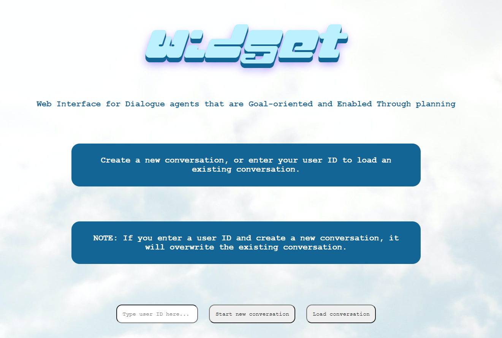
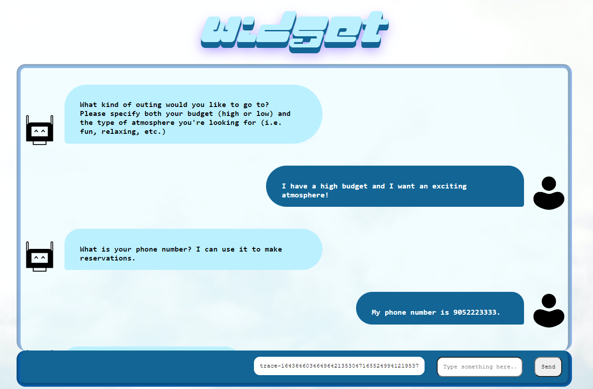

 

# Doing a test run
First, you need to have a Hovor server running. See the [contingent-plan-executor](https://github.com/dialogue-planning/contingent-plan-executor) repo for details.  
With npm installed, clone and cd into the repository and run `npx live-server`.  

# Embedding into your site

You can add the UI to your site in a couple lines of code:

```
// driver code
<script type="module">
    import {host, buildLandingInput, initConvo} from "https://cdn.jsdelivr.net/gh/dialogue-planning/widget/static/js/export.js";
    buildLandingInput(function(){ initConvo(); });
</script>
```


`host` defines where your Hovor server is running. i.e. for a local server, it could be `http://localhost:8080/`. Make sure to redefine it before executing the code.  

`buildLandingInput` is a function that creates a text input and 2 buttons for the user to enter their user ID and whether they want to start a new conversation or load an existing one. The function takes a single function as a parameter, which is executed when the user input is accepted as valid. Here, we are just calling the `initConvo()` function which constructs the "conversation box" and executes the conversation right on the same page. However, you may also want to construct the box after changing the page (seen in `index.html` and `conversation.html` in this example), moving the box, to a different location on the page, adding authentication etc.  

Feel free to change the style of the elements for your own use cases. `buildConvoBox()` in `convo.ts` and `buildLandingInput` in `landing.ts` give a good idea of how the DOM is structured.

# For developers
With typescript installed (easiest way is through npm), use the .ts (not .js) files to update functionality. Convert ts -> js with `tsc -p tsconfig.json`.